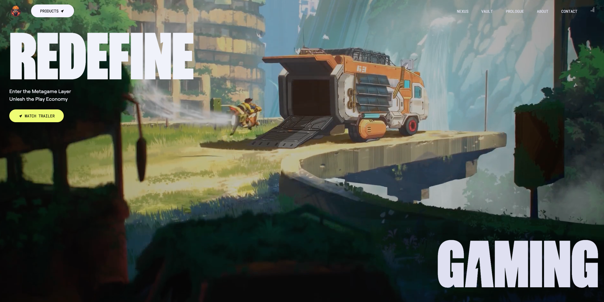
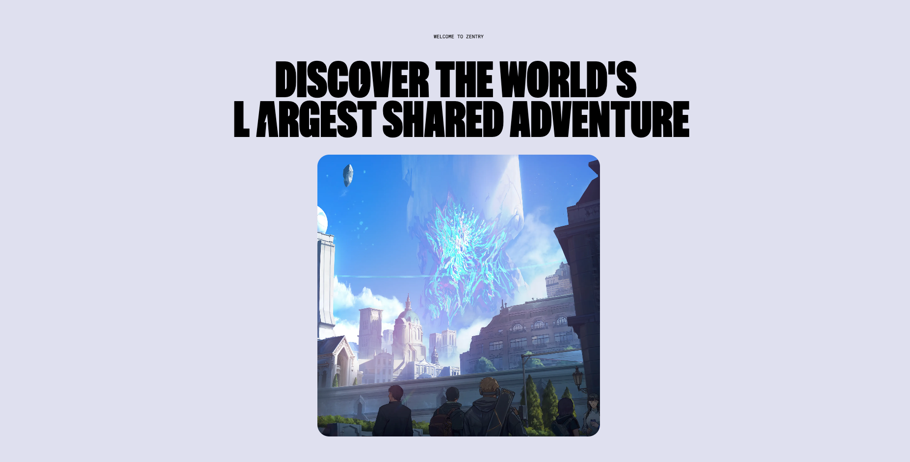
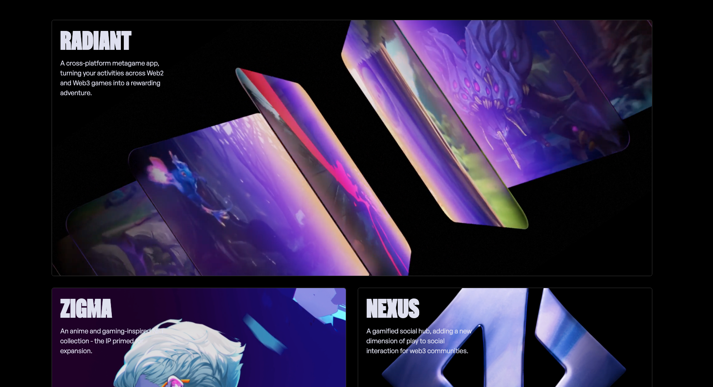
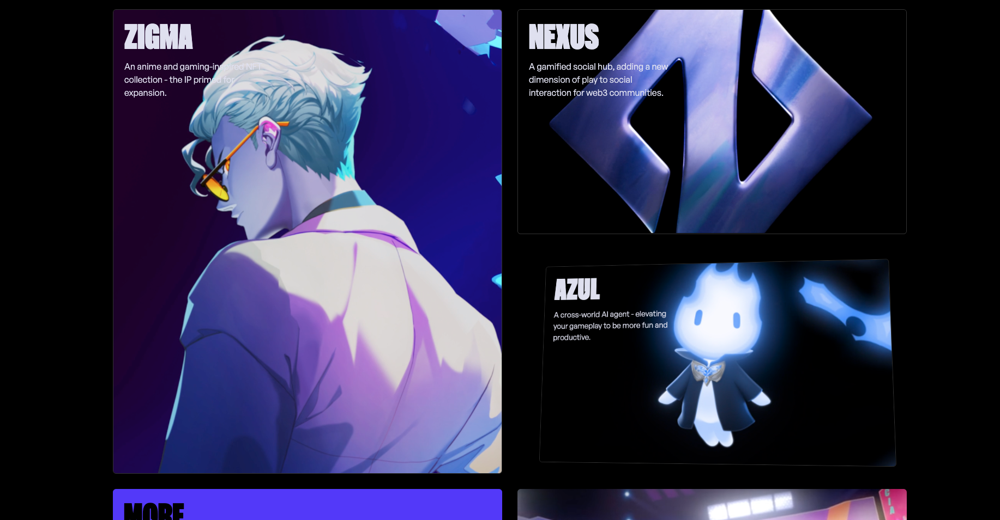
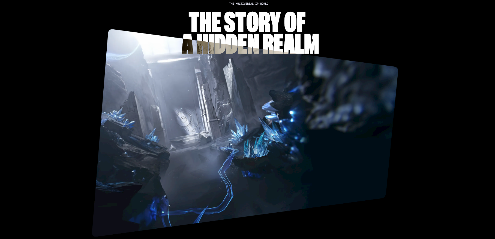

# Zentry Frontend Clone

## 🌟 Project Overview

Zentry Frontend Clone is a meticulously crafted replication of the Zentry website's frontend. This project demonstrates modern UI/UX design principles and highlights the use of cutting-edge frontend development tools and technologies.

---

## 🚀 Features

- **Pixel-Perfect Design**: Matches the original Zentry design closely.
- **Responsive Layout**: Seamlessly adapts to various screen sizes.
- **Modern Tech Stack**: Built using industry-standard tools and frameworks.
- **Reusable Components**: Modular and maintainable codebase.

---

## 🛠️ Technologies Used

- **Frontend Framework**: React
- **Styling**: Tailwind CSS / CSS Modules (as applicable)
- **Build Tool**: Vite / Create React App
- **Version Control**: Git

---

## 📂 Project Structure

```plaintext
zentry-clone/
├── src/
│   ├── components/   # Reusable components
│   ├── assets/       # Images, fonts, and other static assets
│   ├── styles/       # Global and component-specific styles
├── public/           # Public files (e.g., index.html)
├── package.json      # Project dependencies and scripts
└── README.md         # Project documentation
```

---

## 💻 Getting Started

Follow these steps to set up the project locally:

### Prerequisites

- Node.js (v16 or higher recommended)
- npm
- Git

### Installation

1. Clone the repository:

   ```bash
   git clone https://github.com/Sidaculas/zentry-clone.git
   cd zentry-clone
   ```

2. Install dependencies:

   ```bash
   npm install
   ```

3. Start the development server:

   ```bash
   npm run dev

   ```

4. Open your browser and navigate to:

   ```plaintext
   http://localhost:3000
   ```

---

## 🌐 Live Demo

Check out the live version of the project [here](https://zentry-clone-alpha-hazel.vercel.app/).

---

## 📸 Screenshots










---

## 🙏 Acknowledgments

- Original design inspiration: [Zentry](https://zentry.com)

---

## 📧 Contact

For any inquiries, feel free to reach out:

- **GitHub**: [Sidaculas](https://github.com/Sidaculas)
- **Email**: [here](mailto:shafaat.siddhi@gmail.com)
